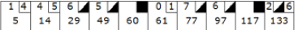

# Bowling Game Kata

Implement a Bowling game.

## Bowling Rules

The game consists of 10 frames. In each frame the player has two rolls to knock down 10 pins. The score for the frame is the total number of pins knocked down, plus bonuses for strikes and spares.

A spare is when the player knocks down all 10 pins in two rolls. The bonus for that frame is the number of pins knocked down by the next roll.

A strike is when the player knocks down all 10 pins on his first roll. The frame is then completed with a single roll. The bonus for that frame is the value of the next two rolls.

In the tenth frame a player who rolls a spare or strike is allowed to roll the extra balls to complete the frame. However no more than three balls can be rolled in tenth frame.

```
class Game {
	void roll(int pins) {...}
	int score() {...}
	bool isOver() {...}
}
```

## Example Game



### List of roles and scores for the example game.

| roll() | score() | isOver() |
|-------:|--------:|:--------:|
| 1      |     1   | false    |
| 4      |     5   |          |
| 4      |     9   |          |
| 5      |    14   |          |
| 6      |    20   |          |
| 4      |    24   |          |
| 5      |    34   |          |
| 5      |    39   |          |
| 10     |    59   |          |
| 0      |    59   |          |
| 1      |    61   |          |
| 7      |    68   |          |
| 3      |    71   |          |
| 6      |    83   |          |
| 4      |    87   |          |
| 10     |   107   |          |
| 2      |   111   |          |
| 8      |   127   |          |
| 6      |   133   | true     |
